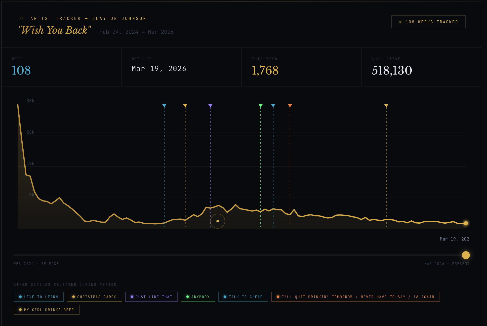
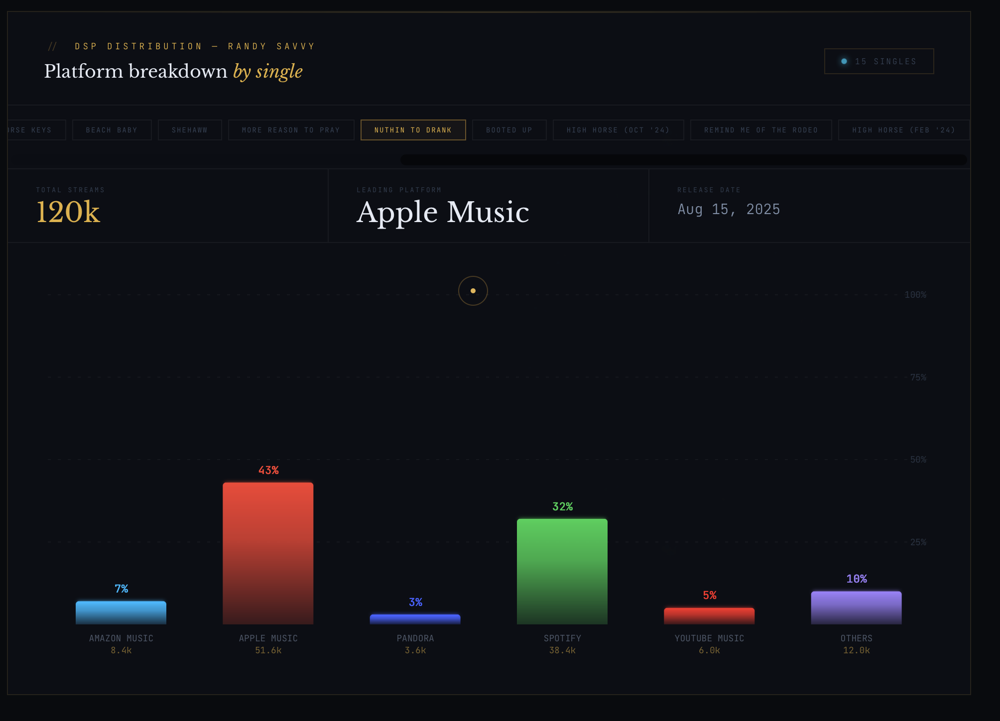

# Artist Streaming Dashboard

## Demo

## Overview
Interactive dashboard to track weekly and cumulative music streaming performance over time.

Built to visualize trends, milestones, and engagement using a clean, real-time UI.

---

## Features
- Time-series chart (Canvas)
- Weekly + cumulative KPIs
- Timeline scrubber interaction
- Animated playback of data
- Release milestone markers
- Dark-themed UI

---

## Tech
- HTML
- CSS
- JavaScript (Canvas API)

---

## Run
Download the file and open:
artist-tracker-dashboard.html
